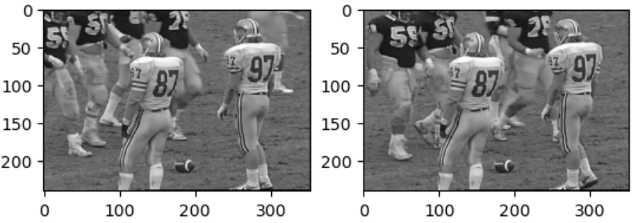
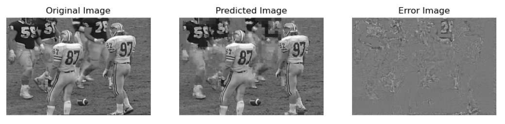
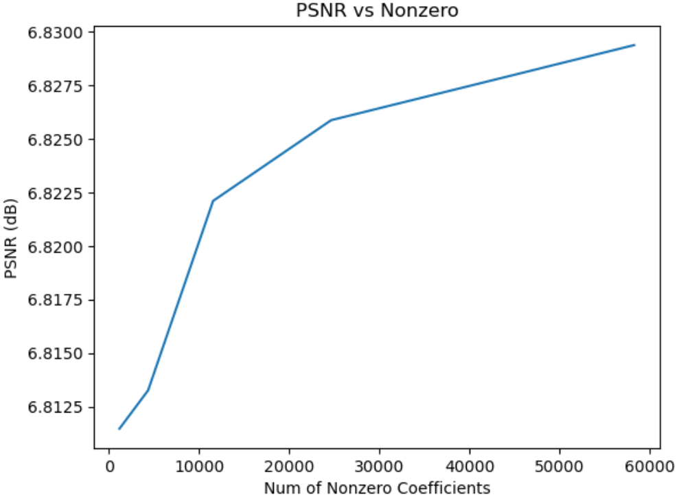
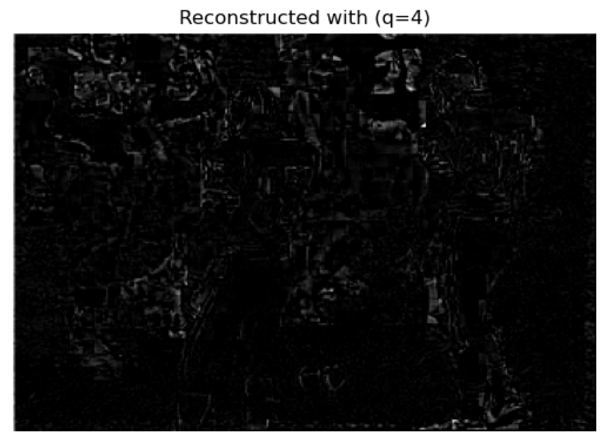
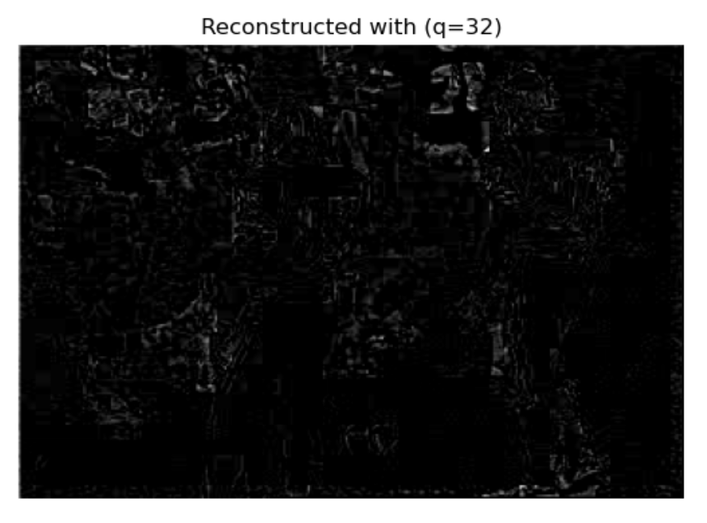
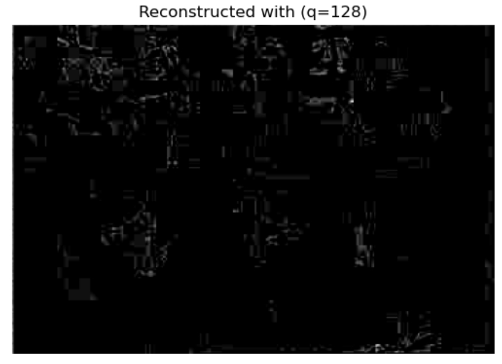

# Block Based Hybrid Video Coding

This project implements a basic block-based hybrid video coder for P-frame coding using 8x8 blocks. The coder includes intra-prediction using three modes and inter-prediction with integer accuracy EBMA.

We are using a Football video for this task. First, we load a frame from the sequence, and then load another frame that is 10 frames after the first one as below:

## Generating Predicted Image and Error Image
We code img2 with intraprediction using reconstructed pixels in the same frame, and interprediction using past frame img1 as reference. We assume that the first row and column of the image are already reconstructed. We also assume that in both inter and intraprediction, the reference pixels were perfectly reconstructed. So we can use the original pixels from img1 and img2 as reference in prediction.

- This section of code will generate two images:

    - **Predicted Image**: Image predicted via intra and inter modes using reference pixels from img2 and img1
    - **Error Image**: Unquantized image of the error between predicted image and original image
      
The results are as below:

## Test different quantization step sizes
Next, using the err_img_pad from above, we quantize the error image with different step sizes. Then add to the predicted image to generate the reconstructed image. We test different step sizes and evaluate PSNR. Plotting the PSNR vs. Nonzero curve:

  
  
  

